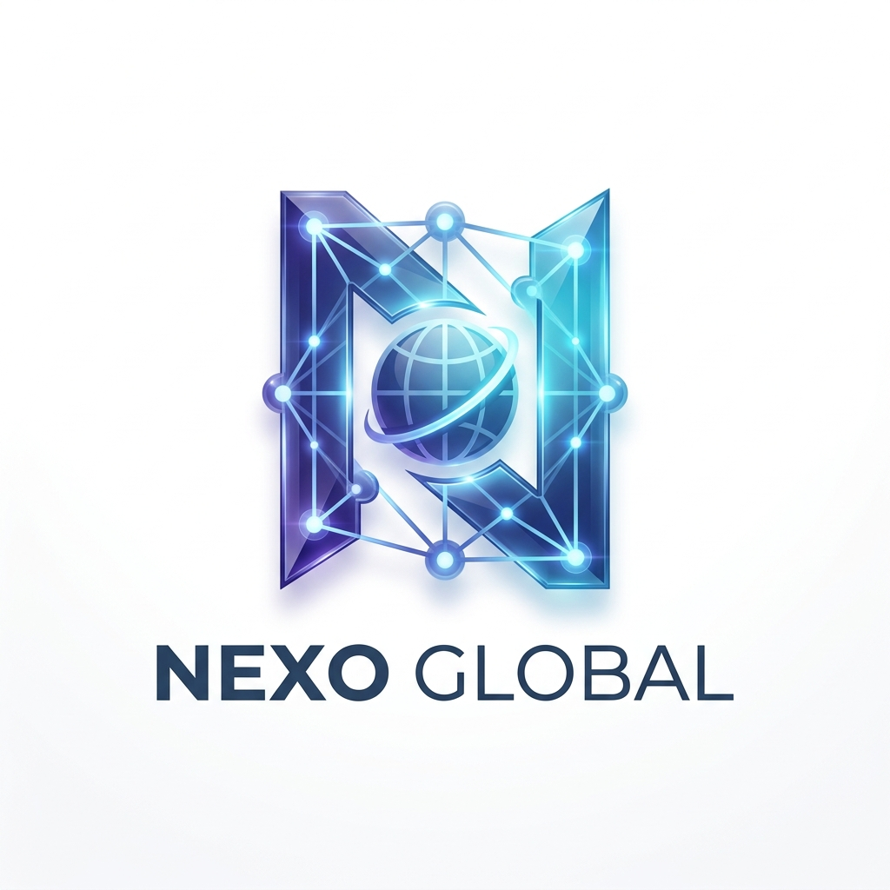

# Nexo Global MLM Ecosystem



Nexo Global is a state-of-the-art Multi-Level Marketing (MLM) platform built with **Next.js 16**, **Supabase**, and **Tailwind CSS 4**. It features a sophisticated binary tree engine, multiple investment tiers, and an automated commission system.

---

## 🚀 Core Features

### 👤 User Features
- **Tiered Investment Model**: Four distinct packages:
  - **Starter**: $2
  - **Plus**: $5
  - **Pro**: $10
  - **Elite**: $20
- **Binary Tree Engine**: Automated placement in a left/right binary structure for each tier.
- **PIN Activation System**: Secure account activation and upgrades using unique PIN codes.
- **Dynamic Dashboard**: Real-time stats for wallet balance, total earnings, and tree growth.
- **Multiple Payment Gateways**:
  - **OxApay**: Automatic crypto payments.
  - **Web3 Wallet**: Direct blockchain interaction.
  - **Manual**: Offline transaction verification.
- **Reward Systems**:
  - **Binary Pair Matching**: 5% bonus on every balanced pair in the tree.
  - **Level Rewards**: Instant bonuses for completing specific tree depths.
- **Financial Module**: Secure USDT-BEP20 withdrawals and internal wallet transfers.

### 🛠️ Admin Suite
- **Comprehensive Analytics**: Monitor total volume, user growth, and pending payouts.
- **User Management**: Activate, block, or manage user roles and balances.
- **Financial Control**: 
  - Approve/Reject PIN requests.
  - Manage pending withdrawals.
  - Override system-wide pricing and limits.
- **Network Overview**: Full visibility into the binary tree across all tiers.

---

## 🛠️ Tech Stack

- **Frontend**: 
  - [Next.js 16](https://nextjs.org/) (App Router)
  - [React 19](https://react.dev/)
  - [Tailwind CSS 4](https://tailwindcss.com/)
  - [Framer Motion](https://www.framer.com/motion/) (Smooth Transitions & Animations)
  - [Lucide React](https://lucide.dev/) (Iconography)
- **Backend & Database**:
  - [Supabase](https://supabase.com/) (PostgreSQL + RLS)
  - [Edge Functions](https://supabase.com/docs/guides/functions) (OxApay Integration)
- **Web3 Integration**:
  - [Wagmi](https://wagmi.sh/) / [Viem](https://viem.sh/)
  - [ConnectKit](https://docs.family.co/connectkit)
- **State Management**:
  - [TanStack Query](https://tanstack.com/query/latest) (v5)

---

## 📊 Database Architecture

The system relies on a robust PostgreSQL schema defined in `unified_setup.sql`:

### Key Tables
- `profiles`: Core user data, wallet balances, and referral codes.
- `tree_positions`: Manages the binary tree structure per package tier.
- `pins`: Stores activation codes generated via purchases or admin.
- `commissions`: Detailed logs of earned bonuses (pair matched, level up).
- `withdraw_requests`: Status tracking for USDT-BEP20 payouts.
- `system_settings`: Key-value store for global configs (min withdraw, package prices).

### Logic Layer (PL/pgSQL Functions)
- `find_automatic_parent`: Intelligent logic to find the next available spot in the binary tree.
- `process_binary_pair_matching`: Automatically calculates and credits bonuses when a pair matches.
- `update_tree_counts`: Recursively updates parent node counts and triggers level rewards.
- `buy_pin_with_balance`: Enables internal reinvestment using wallet funds.

---

## ⚙️ Initial Setup

### Pre-requisites
- Node.js 20+
- Supabase Project

### Installation
1. Clone the repository:
   ```bash
   git clone [repository-url]
   cd dream-mlm
   ```
2. Install dependencies:
   ```bash
   npm install
   ```
3. Configure Environment Variables (`.env.local`):
   ```env
   NEXT_PUBLIC_SUPABASE_URL=your_project_url
   NEXT_PUBLIC_SUPABASE_ANON_KEY=your_anon_key
   OXAPAY_MERCHANT_KEY=your_oxapay_key
   ADMIN_WALLET_ADDRESS=0x...
   NEXT_PUBLIC_WALLETCONNECT_ID=your_id
   ```
4. Run Database Setup:
   - Execute the contents of `unified_setup.sql` in your Supabase SQL Editor.
5. Start development:
   ```bash
   npm run dev
   ```

---

## 🔒 Security & Performance
- **Row Level Security (RLS)**: Every table is hardened with Supabase RLS policies to ensure users only access their own data.
- **Optimistic UI**: Use of TanStack Query for seamless, fast-feeling interactions.
- **Server Actions**: Secure, server-side data mutations.

---

## 📄 License
This project is private and intended for use by Life Dreams PK / Nexo Global.
